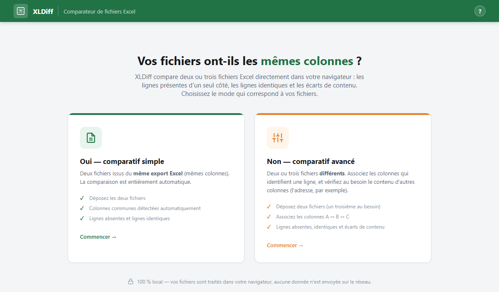
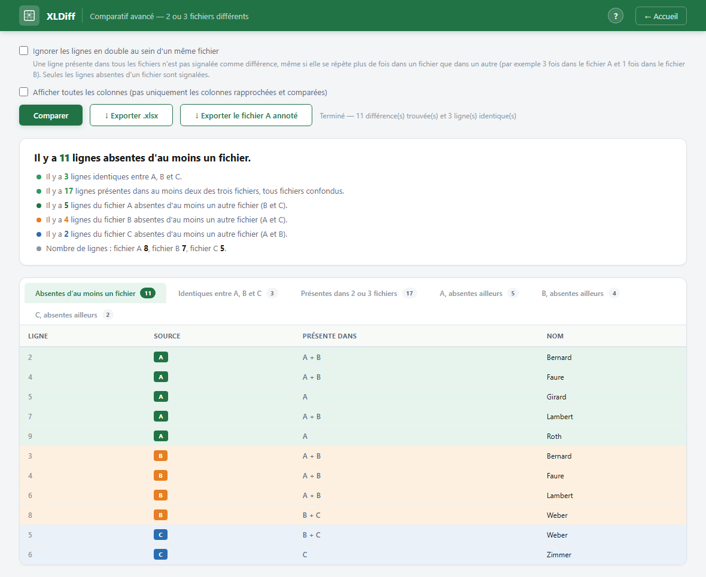
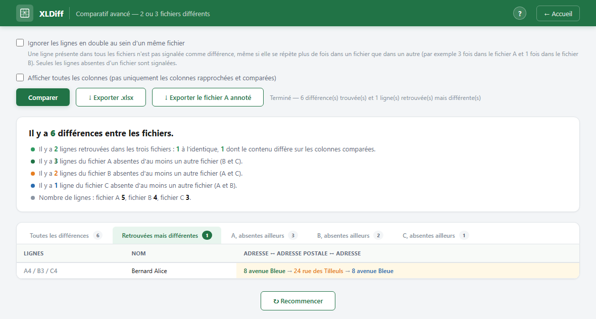
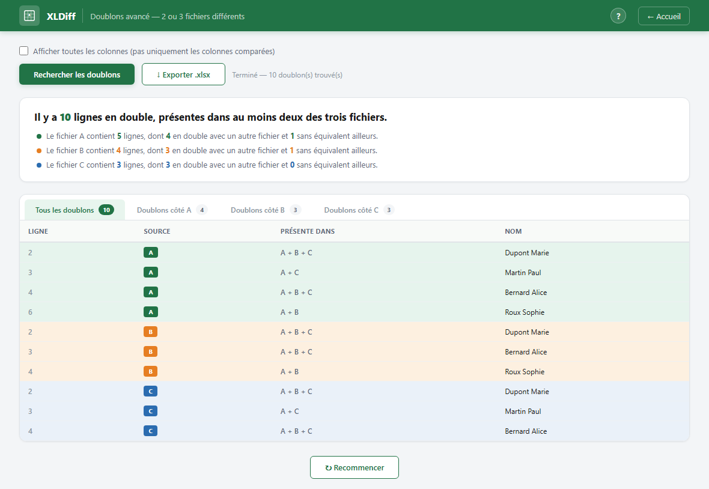
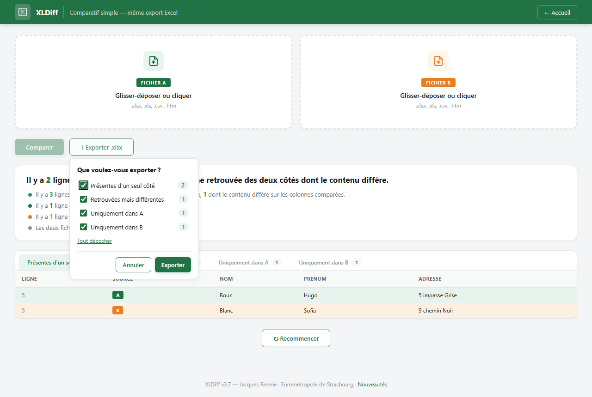
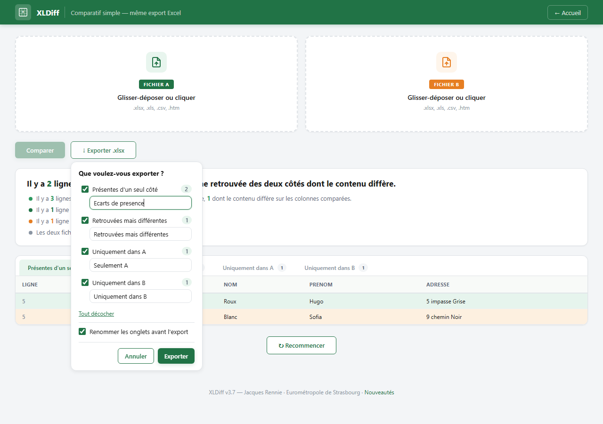
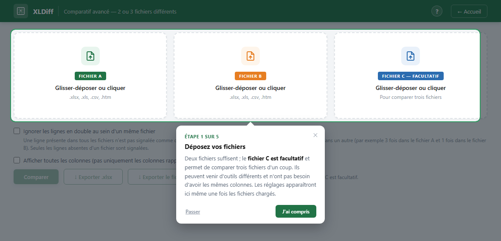

# XLDiff — Comparateur de fichiers Excel

**Version 3.8**

Outil web 100 % local pour analyser deux ou trois fichiers Excel. Aucune donnée n'est envoyée sur le réseau : tout le traitement s'effectue dans le navigateur.

La page d'accueil pose la question « **Que recherchez-vous ?** » :

- **Les différences entre deux fichiers** — les lignes présentes dans l'un mais absentes de l'autre ;
- **Les doublons entre deux fichiers** — les lignes présentes à la fois dans les deux fichiers.

Chaque analyse propose ensuite la même question « **Vos deux fichiers ont-ils les mêmes colonnes ?** », qui mène au mode simple (colonnes identiques, tout est automatique) ou avancé (fichiers différents, association de colonnes).



## Recherche de différences : deux modes

### Comparatif simple
Pour deux fichiers issus du **même export Excel** (mêmes colonnes). Les colonnes communes sont détectées automatiquement et la comparaison porte sur toutes les colonnes — aucun réglage nécessaire.

### Comparatif avancé
Pour deux ou trois fichiers **différents** (le **fichier C est facultatif**), en trois étapes :

1. **Choix des feuilles** — si un fichier contient plusieurs feuilles (onglets Excel), un panneau permet de choisir la feuille à comparer pour chaque fichier (la feuille contenant le plus de données est pré-sélectionnée).
2. **Colonnes de rapprochement** — l'utilisateur associe les colonnes qui identifient une ligne (mapping colonne A ↔ B ↔ C, avec pré-association automatique des colonnes de même nom). Ces colonnes forment la clé : une ligne sans équivalent dans un autre fichier est signalée.
3. **Colonnes à comparer** (facultatif) — une fois la ligne retrouvée dans chaque fichier, le contenu de ces colonnes est vérifié. Une ligne retrouvée dont une de ces colonnes diffère n'est pas une absence : elle remonte dans la catégorie **« Retrouvées mais différentes »**, avec la valeur de chaque fichier côte à côte (`3 rue Verte → 8 av. Bleue`). Sans aucune colonne ici, le comportement est celui des versions précédentes (seule la présence des lignes est vérifiée).

Cas d'usage typique : rapprocher sur *nom + date de naissance*, puis comparer *adresse*.


Avec trois fichiers, chaque fichier a son onglet de lignes absentes ailleurs et le tableau porte une colonne **« Présente dans »** (`A + B` = ligne absente de C).



L'onglet **« Retrouvées mais différentes »** montre la valeur de chaque fichier côte à côte :



Dans les résultats, une case « Afficher toutes les colonnes » permet de basculer entre l'affichage des seules colonnes rapprochées et comparées et l'affichage complet.

Un second bouton d'export, « **Exporter le fichier A annoté** », reprend le fichier A tel quel — toutes ses lignes et toutes ses colonnes — et ajoute à droite `Statut`, `Présente dans`, `Colonnes en écart`, la valeur de chaque autre fichier pour les colonnes comparées, et `Ligne d'origine`. Les lignes venues de B ou C et absentes de A sont ajoutées à la suite (seules leurs colonnes de rapprochement sont reportées, pour ne pas faire passer une valeur de B pour une valeur de A). Comme tout export d'XLDiff, la feuille produite ne porte que les colonnes qu'au moins une ligne renseigne (voir *[Les colonnes sans aucune valeur ne sont pas écrites](#les-colonnes-sans-aucune-valeur-ne-sont-pas-écrites)*).

Une case « **Ignorer les lignes en double au sein d'un même fichier** » (décochée par défaut) change la règle de comparaison : cochée, une ligne dont la clé est présente dans tous les fichiers n'est jamais une différence, même si elle se répète un nombre de fois différent de l'un à l'autre (ex. 3 fois dans A, 1 fois dans B) ; seules les clés absentes d'au moins un fichier sont signalées, avec toutes leurs occurrences. Basculer la case après une comparaison relance automatiquement l'analyse.

## Recherche de doublons : deux modes

L'outil liste les lignes **communes à plusieurs fichiers**, c'est-à-dire l'inverse de la recherche de différences.

- **Doublons simple** — deux fichiers issus du même export (mêmes colonnes) : les colonnes communes sont détectées automatiquement, deux lignes sont en double si toutes leurs colonnes sont identiques.
- **Doublons avancé** — deux ou trois fichiers différents (le **fichier C est facultatif**) : choix des feuilles puis association des colonnes A ↔ B ↔ C, comme le comparatif avancé ; deux lignes sont en double si les colonnes associées sont identiques.

Avec trois fichiers, une ligne est en double dès que sa clé existe dans **au moins un autre fichier** — l'inverse exact de la recherche de différences, où une ligne remonte dès qu'elle est absente d'au moins un fichier. La colonne **« Présente dans »** indique les fichiers concernés (`A + B`, `B + C`, `A + B + C`) et chaque fichier a son onglet de lignes en double. Le nombre d'occurrences retenues dans un fichier est plafonné au plus grand nombre d'occurrences trouvé dans les autres (3 fois dans A, 1 fois dans B, 2 fois dans C → 2 lignes remontées côté A).



## Résultats

Les résultats commencent par un résumé en phrases simples (« Il y a N lignes retrouvées dans les deux fichiers : X à l'identique, Y dont le contenu diffère », « Il y a X lignes uniquement dans A »…), suivi du détail ligne par ligne dans des onglets, d'un export `.xlsx` et d'un bouton **Recommencer** pour repartir d'une page vierge.

L'export reprend **un à un les onglets retenus** : même libellé, même contenu, même ordre qu'à l'écran. À deux fichiers on obtient « Présentes d'un seul côté », « Retrouvées mais différentes » (si des colonnes sont comparées), « Uniquement dans A » et « Uniquement dans B » ; à trois fichiers, « Absentes d'au moins un fichier », puis « A, absentes ailleurs », « B, absentes ailleurs », « C, absentes ailleurs ».

Les deux natures d'écart sont **comptées séparément et ne se recouvrent jamais** : une ligne est soit sans équivalent dans l'autre fichier, soit retrouvée avec un contenu qui diverge. Le premier onglet ne contient donc que la première nature — il s'appelait « Toutes les différences », ce qui le faisait lire comme un total qu'il n'a jamais été. Un onglet sans ligne donne une feuille réduite à son en-tête, pour qu'on la retrouve dans le classeur comme on la voit à l'écran. Dans la feuille « Retrouvées mais différentes », chaque colonne comparée occupe une colonne par fichier (`Adresse (A)`, `Adresse (B)`), suivie de la liste des colonnes en écart. Le fichier est écrit compressé.

Les feuilles sont construites à partir de `buildTabs()`, la même fonction que celle qui dessine les onglets (`results-view.js`) : l'écran et le fichier exporté ne peuvent pas diverger.

### Les colonnes sans aucune valeur ne sont pas écrites

**Une colonne qu'aucune ligne ne renseigne est retirée de la feuille exportée, en-tête compris.** Une colonne présente dans les fichiers mais jamais remplie encombrait le classeur sur toute sa largeur, et il fallait la supprimer à la main avant de retravailler le résultat.

Le filtre s'applique aux **deux boutons d'export sans exception** — le classeur par onglets des quatre comparatifs et le fichier A annoté — et **à chaque feuille séparément** : une colonne renseignée dans « Uniquement dans A » mais vide dans « Uniquement dans B » reste dans la première feuille et disparaît de la seconde. Les colonnes ajoutées par XLDiff n'y échappent pas : « Colonnes en écart » quand aucune ligne n'en porte, une colonne `Adresse (B)` restée blanche.

**Une cellule réduite à des espaces compte pour vide.** `String(v).trim()` suffit : en JavaScript, `\s` couvre déjà l'espace insécable `U+00A0` et son cousin étroit `U+202F`, ceux que sèment les exports Excel — sans quoi une colonne d'apparence blanche survivrait au filtre.

Deux réserves, une à chaque bout : **une feuille sans aucune ligne de données garde son en-tête entier** (rien à filtrer, et une feuille sans la moindre colonne ne renseignerait sur rien), et une feuille dont toutes les colonnes seraient vides le garde aussi. Dans les deux cas, comme lorsque toutes les colonnes sont remplies, le tableau part tel quel sans recopie.

`retirerColonnesVides()` (`results-view.js`) s'intercale entre la construction du tableau de tableaux et `aoa_to_sheet` — un seul point de passage pour les deux exports. Le balayage s'arrête dès que chaque colonne a trouvé une valeur : sur un export dense, il ne lit que les toutes premières lignes.

**Rien ne change à l'écran** : les onglets affichent toujours toutes les colonnes, et le tri n'est fait qu'à l'écriture du fichier. Il n'est commandé par aucun réglage — il n'y a pas de case pour le désactiver.

La colonne **« Ligne »** donne le **vrai numéro de ligne Excel**, y compris quand le fichier contient des lignes vides. Celles-ci sont écartées à la lecture, mais elles ne décalent pas les lignes suivantes : le chargeur convertit la feuille avec `blankrows: true` (une entrée par ligne de la plage, vide ou non) et pose le numéro avant d'écarter les vides (`file-loader.js`). Le nombre de lignes annoncé dans la zone de dépôt est celui des lignes retenues, donc le même que celui du résumé.

Modifier un réglage après une comparaison — une association de colonnes, la feuille choisie, un fichier remplacé — **retire les résultats affichés et désactive les exports** jusqu'à un nouveau clic sur « Comparer ». Sans ça, les boutons restaient actifs et exportaient en silence l'analyse précédente. La coche « Ignorer les doublons » fait l'inverse et relance l'analyse : c'est un réglage à deux états, pas une liste qu'on remanie sélecteur par sélecteur.

### Choisir les onglets à exporter

Le bouton **« Exporter .xlsx »** n'écrit pas aussitôt : il ouvre sous lui un panneau — *Que voulez-vous exporter ?* — qui liste les onglets affichés, chacun avec son nombre de lignes.



**Toutes les cases sont cochées à chaque ouverture**, y compris après un export partiel : le classeur ne peut pas se retrouver amputé par un réglage laissé de côté la fois précédente. Un lien *Tout décocher* / *Tout cocher* traite la liste d'un coup. *Annuler*, `Échap` ou un clic à côté referment sans rien écrire — et sans annoncer « Export terminé », qui n'apparaît qu'une fois le fichier produit. Tant qu'aucune case n'est cochée, le bouton *Exporter* reste inactif : un classeur sans aucune feuille n'existe pas.

Le panneau se remplit lui aussi avec `buildTabs()` : ce qu'il propose est exactement ce qui est affiché, et le contenu d'une feuille ne dépend pas de la sélection. Il est posé en **coordonnées de document**, donc suit la page au défilement sans écouteur, et se recale contre le bord droit de la fenêtre quand le bouton est trop à droite. Il passe **sous** la visite guidée (`z-index` 900 contre 950 et au-delà), qui reste prioritaire. Le second bouton, « Exporter le fichier A annoté », ne produit qu'une seule feuille : ce panneau ne le concerne pas et il exporte directement — le retrait des colonnes vides, lui, s'applique aux deux.

### Renommer les onglets avant l'export

La case **« Renommer les onglets avant l'export »**, décochée par défaut, ouvre sous chaque onglet retenu un champ pré-rempli avec son libellé : ce qui y est écrit devient le nom de la feuille dans le classeur, et un champ laissé tel quel donne exactement le fichier d'avant.



Les champs **suivent les cases** : décocher un onglet retire le sien, et sa saisie est conservée tant que le panneau reste ouvert — un décochage par mégarde n'efface rien. Comme les cases, tout repart à zéro à l'ouverture suivante.

**Un nom qu'Excel refuserait bloque l'export plutôt que d'être corrigé en douce** : le champ passe en rouge, la raison s'affiche dessous et le bouton *Exporter* reste inactif. Sont refusés le nom vide, plus de 31 caractères, les caractères `: \ / ? * [ ]`, l'apostrophe en début ou en fin, et un nom déjà porté par un autre onglet retenu (la casse ne distingue pas deux feuilles pour Excel). Le verdict est rendu à la frappe (`input`, pas `change`), et `Entrée` depuis un champ lance l'export dès qu'il n'y a plus de faute. `nomFeuille()` reste appliqué en dernier ressort à tous les noms, saisis ou non.

Un doublon n'est cherché que parmi les onglets **retenus** : deux noms identiques dont l'un est décoché ne posent aucun problème, puisqu'une seule feuille sera écrite. La liste du panneau est bornée en hauteur (`max-height`) et défile toute seule : avec trois fichiers et les champs ouverts, elle dépasserait la fenêtre.

## Aide et prise en main

Chaque page porte sa propre aide, en deux dispositifs volontairement légers (`assets/js/help.js`, `assets/css/help.css` — aucune dépendance, tout le balisage est injecté à l'exécution).

### La visite suit l'usager

**Une bulle ne parle jamais d'une zone qui n'est pas à l'écran.** Chaque étape porte le sélecteur de sa zone, et ce sélecteur décrit aussi l'état attendu de l'interface (`#mappingPanel.visible`, `#btnCompare:not([disabled])`, `#results.visible`). Une étape dont la zone n'existe pas encore patiente ; une étape dont la zone n'apparaîtra jamais (le panneau « Choix des feuilles » quand tous les classeurs n'ont qu'un onglet) est enjambée.

La visite se déroule donc en deux temps :

1. **À l'ouverture** — les étapes dont la zone est déjà affichée s'enchaînent, avec *Passer*, *Précédent* et *Suivant*. Sur une page de comparaison vide, cela se réduit à une seule bulle : les zones de dépôt. Le bouton de droite annonce ce qui suit — *Suivant ›* si l'étape d'après est à l'écran, sinon *J'ai compris*, jamais un « Suivant » qui ne mènerait nulle part.

   

2. **Plus tard** — les étapes suivantes attendent que leur zone apparaisse (fichiers déposés, résultats affichés) et se montrent au moment voulu, sur le panneau qui vient de s'afficher.

   

**Tant qu'une bulle est affichée, l'application est figée — sauf la zone dont elle parle.** Le voile n'est pas une nappe pleine mais un **cadre en quatre pièces** posé autour de la zone désignée : le reste de la page est assombri et n'accepte plus le moindre clic, tandis que la carte, le bouton ou le menu que la bulle explique reste utilisable, directement depuis la bulle. Le projecteur (`.xld-spot`) est en `pointer-events: none` pour ne pas boucher le trou.

Vérifié dans un vrai navigateur plutôt que sur le seul CSS : `elementFromPoint` interrogé sur six points renvoie l'élément de l'application à l'intérieur de la zone désignée, et une pièce du cadre partout ailleurs (bouton *Comparer*, cases à cocher, bouton « ? »).

L'usager reprend la main sur toute la page dès qu'il masque la bulle : bouton, croix, clic sur le cadre, `Échap`, ou fichier glissé sur la fenêtre (ce dernier geste masque la bulle pour que le dépôt aboutisse).

### Le placement, une seule règle pour toutes les tailles d'écran

Aucun réglage par page : c'est la géométrie qui décide, en quatre temps.

1. **Faire de la place** — si la zone et la bulle peuvent tenir ensemble, la page est positionnée pour amener le haut de la zone en haut de la fenêtre ; sinon on montre au moins son début. Le défilement vise une position **absolue et bornée au document** (un défilement relatif s'ajouterait à une animation en cours et pouvait sortir de la page).
2. **Écrêter** — une zone plus haute que la fenêtre est traitée par sa partie visible.
3. **Choisir** — dessous, dessus, à droite, à gauche : le premier placement qui tient *entièrement* dans la fenêtre gagne, et porte une flèche vers sa zone.
4. **Accoster** — si aucun ne tient, la bulle se range contre le bord qui **recouvre le moins** la zone (à égalité, le bas, pour laisser voir le titre et les premiers champs), sans flèche.

La décision est lisible dans l'attribut `data-pose` de la bulle (`dessous`, `bord-haut`…), ce qui permet de la vérifier en test. Le placement est **synchrone** : rien n'est confié à `requestAnimationFrame`, qui ne se déclenche pas dans un onglet en arrière-plan et laissait alors la bulle sans position.

Pendant l'affichage, la page est verrouillée sur sa position de défilement (et non figée par `overflow: hidden`, qui déplaçait la mise en page quand un défilement animé était en cours) et le défilement fluide de la page est neutralisé.

Côté format : largeur `min(350 px, 100vw − 24)`, bandeau pleine largeur sous 560 px, rembourrage réduit sous 480 px de haut, et défilement interne si la fenêtre est vraiment basse.

**Vérification en matrice** : un pilote parcourt toutes les étapes de chaque page à plusieurs tailles de fenêtre (1366×655, 1280×600, 1024×500, 900×420) et produit un tableau — placement retenu, bulle entièrement à l'écran, part de la zone recouverte. Le critère : aucune bulle hors écran, et recouvrement nul dès qu'un placement tient.

### Quand la visite s'ouvre d'elle-même

**À chaque visite du site ou ouverture de l'application** — mais une seule fois par page et par visite : la trace est de portée *session* (`sessionStorage`, clé `xldiff.visite.<page>`), si bien qu'un aller-retour entre les pages ne la rejoue pas, alors qu'une nouvelle venue si.

La première bulle porte un bouton **« Je sais utiliser l'application »** : il inscrit un renoncement **durable et global** (`localStorage`, clé `xldiff.aide.jamais`) et plus aucune présentation ne s'ouvrira d'elle-même, sur aucune page. Le volet du « ? » propose alors, et alors seulement, de **réafficher la présentation à chaque visite**. À distinguer de *Passer*, qui n'écarte la visite que pour cette visite-ci.

Deux garde-fous : la visite s'abstient si l'usager s'est **déjà mis au travail** pendant le court délai d'attente (dépôt de fichier, frappe, ou clic sur un élément actif — un clic dans le décor ne compte pas) ; et si le navigateur refuse le stockage (navigation privée, stratégie d'entreprise, certains postes en `file://`), tout retombe sur une mémoire vive plutôt que de priver l'usager de la présentation.

`XLDiffAide.etat()` renvoie l'état complet (page, version, vue pendant cette visite, renoncement, type de stockage, interaction détectée) — de quoi diagnostiquer en une ligne pourquoi la présentation ne s'est pas lancée.

Techniquement, l'apparition des zones est détectée par un `MutationObserver` (classes `visible`, attribut `disabled`), sans que les autres scripts aient à prévenir l'aide de quoi que ce soit.

### Le bouton « ? »

Dans l'en-tête de chaque page, il ouvre un volet d'aide complet (étapes, options, lecture des résultats, questions fréquentes) et propose **« Revoir la présentation de la page »**, qui rejoue la visite à la demande — en repartant, là encore, de ce qui est réellement affiché.


Une page déclare simplement `window.XLDIFF_PAGE = 'advanced'` avant le script ; tout le contenu (bulles, sections, FAQ) est centralisé dans `help.js`. `Échap` ferme le volet, et écarte la bulle courante sans renoncer à la suite.

Cette aide intégrée **remplace le guide utilisateur Word** diffusé jusqu'à la v2.5 : la documentation vit désormais dans l'application, au plus près de l'écran concerné, et suit automatiquement chaque évolution de l'interface.

## Formats supportés

`.xlsx`, `.xls`, `.csv`, `.htm` / `.html` (exports Excel au format HTML, y compris les exports d'anciens outils — plusieurs stratégies de lecture de repli sont implémentées).

## Utilisation

Aucune installation : utiliser le site en ligne **https://ryosaeba89.github.io/xldiff/**, ouvrir `index.html` dans un navigateur, ou héberger le dossier tel quel (serveur web statique).

1. Sur la page d'accueil, répondre à la question « Que recherchez-vous ? » (différences ou doublons), puis choisir le mode le cas échéant.
2. Glisser-déposer les deux fichiers — un troisième au besoin dans les deux modes avancés (sélection de feuille possible si le classeur en contient plusieurs).
3. Cliquer sur **Comparer** (ou **Rechercher les doublons**).
4. Consulter le résumé puis le détail par onglets, et éventuellement **Exporter** le résultat en `.xlsx` — en choisissant, dans le panneau qui s'ouvre, les onglets à mettre dans le fichier (tous cochés au départ). Les colonnes qu'aucune ligne ne renseigne ne sont pas écrites.

## Architecture

```
XLDiff/
├── index.html              Page d'accueil (question « Que recherchez-vous ? » puis choix du mode)
├── pages/
│   ├── simple.html         Différences, mode simple
│   ├── advanced.html       Différences, mode avancé
│   ├── doublons.html       Doublons, mode simple
│   └── doublons-avance.html  Doublons, mode avancé
├── assets/
│   ├── css/
│   │   ├── theme.css       Variables, base, en-tête, boutons (commun)
│   │   ├── home.css        Styles de la page d'accueil
│   │   ├── compare.css     Styles des pages de comparaison
│   │   └── help.css        Visite guidée et volet d'aide
│   ├── js/
│   │   ├── file-loader.js  Lecture des fichiers + zones de dépôt (XLDiffFiles)
│   │   ├── diff-engine.js  Moteur d'analyse 2 ou 3 fichiers (XLDiffEngine)
│   │   ├── results-view.js Rendu des résultats + export (XLDiffResults)
│   │   ├── simple.js       Contrôleur des modes simples (diff ou doublons via window.XLDIFF_MODE)
│   │   ├── advanced.js     Contrôleur des modes avancés (diff ou doublons via window.XLDIFF_MODE)
│   │   └── help.js         Onboarding + aide de chaque page (XLDiffAide, via window.XLDIFF_PAGE)
│   ├── screenshots/        Captures utilisées par ce README
│   └── vendor/
│       └── xlsx.full.min.js  SheetJS 0.18.5 (embarqué, aucune dépendance réseau)
└── README.md
```

Le code n'utilise aucun framework ni gestionnaire de paquets : JavaScript natif, la seule librairie (SheetJS) est embarquée dans `assets/vendor/`.

## Application de bureau (xldiff.exe)

L'application web peut être encapsulée dans un exécutable Windows **portable** avec [Tauri](https://tauri.app) : tout XLDiff (HTML, CSS, JS, SheetJS) est embarqué dans le binaire (~8 Mo), aucune ressource externe n'est téléchargée ni requise au lancement. Tauri n'embarque **pas** de navigateur : il s'appuie sur **WebView2**, le moteur d'Edge fourni et maintenu par Windows (préinstallé sur Windows 10/11).

Prérequis de build (poste de développement uniquement) : Rust + outils MSVC, Node.js. La toolchain **MSVC est imposée** par `rust-toolchain.toml` : avec la toolchain GNU, l'exe dépendrait de `WebView2Loader.dll` (liaison dynamique) et ne serait plus autonome. La CRT est liée en statique (`.cargo/config.toml`) pour ne dépendre d'aucun redistribuable Visual C++ ni d'aucune DLL CRT sur les postes. Si le runtime WebView2 manque (certains Windows 10 / VDI), l'application affiche un message explicite au lancement.

```
npm install        # une seule fois (CLI Tauri)
npm run exe        # copie l'app dans dist/ puis compile
```

Le binaire est produit dans `src-tauri/target/release/xldiff.exe` — un seul fichier à copier sur un lecteur réseau ou à diffuser via Nextcloud. Il se lance d'un double-clic, sans installation. L'export `.xlsx` ouvre une boîte de dialogue Windows « Enregistrer sous » (téléchargement intercepté côté Rust, l'application web reste inchangée).

Fichiers concernés : `src-tauri/` (configuration, icônes, enveloppe Rust), `scripts/make-dist.js` (copie de l'app web dans `dist/`), `scripts/make-icon.js` (régénération de l'icône source si besoin).

### Signature de l'exécutable

```
npm run sign       # signe src-tauri/target/release/xldiff.exe
```

La signature utilise un certificat de signature de code **auto-signé** (« XLDiff - Jacques Rennie, Eurométropole de Strasbourg »), stocké dans le magasin personnel du poste de build (`Cert:\CurrentUser\My`), avec horodatage DigiCert. Elle garantit l'intégrité du binaire et identifie l'éditeur, mais n'étant pas émise par une autorité reconnue, elle ne supprime pas l'avertissement SmartScreen sur les postes qui n'approuvent pas le certificat.

La partie publique du certificat est dans `signing/xldiff-code-signing.cer`. Pour qu'un poste reconnaisse la signature comme valide (utilisateur courant, sans droits admin) :

```powershell
Import-Certificate -FilePath signing\xldiff-code-signing.cer -CertStoreLocation Cert:\CurrentUser\Root
Import-Certificate -FilePath signing\xldiff-code-signing.cer -CertStoreLocation Cert:\CurrentUser\TrustedPublisher
```

Pour une confiance sur tout le parc, la voie propre reste un certificat émis par la CA interne de la collectivité ou un certificat de signature de code commercial (déployable par GPO).

## Sites en ligne et livraison (CI)

L'application est publiée sur deux sites, qui servent **exactement le même contenu** — `index.html` + `pages/` + `assets/`, rien d'autre :

| | Site | Job |
|---|---|---|
| GitHub | https://ryosaeba89.github.io/xldiff/ | `.github/workflows/pages.yml` |
| GitLab | GitLab Pages de l'instance | job `pages` du `.gitlab-ci.yml` |

Le traitement reste 100 % local dans le navigateur : aucun fichier comparé n'est envoyé à un serveur.

**GitHub demande un réglage, GitLab non.** Sur GitHub, il faut passer *Settings > Pages > Source* de « Deploy from a branch » à « GitHub Actions » — Pages y servait jusqu'ici la **racine du dépôt**, donc aussi `src-tauri/`, `scripts/`, `signing/` et le README. Sur GitLab il n'existe **aucun réglage de source** : le site est entièrement piloté par le job `pages`, il n'y a rien à activer dans les paramètres du projet.

### Poser une version

Les deux plateformes créent leur release à la pose d'un tag `v…`, à partir des **mêmes sources de vérité** : le numéro de version du dépôt et `CHANGELOG.md`. Trois scripts partagés l'assurent :

- `scripts/verifie-version.js` — vérifie que les **neuf endroits** qui portent le numéro (`package.json`, `Cargo.toml`, `Cargo.lock`, `tauri.conf.json`, `CHANGELOG.md`, la page Nouveautés et les pieds de page) s'accordent avec le tag. Un oubli **arrête la livraison** au lieu de la traverser et d'aboutir à un site ou un exe qui annonce une version fausse.
- `scripts/notes-de-version.js` — extrait de `CHANGELOG.md` la section de la version, qui devient le corps de la release. Les notes ne sont jamais recopiées à la main, donc GitHub et GitLab publient le même texte.
- `scripts/payload-gitlab.js` — fabrique le JSON de la release GitLab avec `JSON.stringify`, parce que les notes contiennent guillemets, apostrophes et retours à la ligne qu'un heredoc shell finirait par mal échapper.

Les deux premiers se lancent en local, avant de poser le tag :

```bash
node scripts/verifie-version.js        # déduit la version de package.json
node scripts/notes-de-version.js v3.5  # aperçu des notes qui seront publiées
```

Côté GitLab, la release est créée par un `curl` sur l'API avec `CI_JOB_TOKEN`, le jeton que GitLab fabrique pour chaque exécution — aucun secret à déclarer. C'est aussi le **seul chemin qui fonctionne depuis ce poste**, dont l'identifiant ne vaut que pour `git` : toute l'API répond 401. Même recette que la pipeline d'ATGRC.

### L'exe n'est pas compilé par la CI

C'est délibéré. `xldiff.exe` est signé avec un certificat qui vit dans le magasin personnel du poste de développement (cf. *Signature de l'exécutable*) : un runner ne peut pas le signer et produirait un binaire nu — c'est-à-dire exactement ce que les contrôles applicatifs des postes regardent de plus près.

L'exe signé est donc **versionné dans `release/xldiff.exe`**. GitHub l'attache à la Release, GitLab pointe dessus au tag. Publier une version tient alors en une suite :

```bash
# 1. monter la version (les neuf endroits) et écrire le CHANGELOG
node scripts/verifie-version.js

# 2. compiler et signer
npm run exe && npm run sign
cp src-tauri/target/release/xldiff.exe release/xldiff.exe

# 3. committer, taguer, pousser : les deux pipelines font le reste
git add -A && git commit -m "v3.5 : ..."
git tag -a v3.5 -m "XLDiff v3.5"
git push github main --tags && git push gitlab main --tags
```

Tant que `release/xldiff.exe` n'est pas versionné, les deux releases se publient quand même — sans lien de téléchargement, et en le disant plutôt qu'en offrant un bouton qui renvoie une 404.

## Notes techniques

- La comparaison est une différence de multi-ensembles : les répétitions sont prises en compte (si une clé apparaît 3 fois dans A et 1 fois dans B, 2 lignes sont signalées « uniquement A »). Avec trois fichiers, chaque fichier est comparé au **minimum** des occurrences de la clé sur l'ensemble des fichiers — la règle à deux fichiers en est le cas particulier. La case « Ignorer les lignes en double au sein d'un même fichier » du comparatif avancé bascule en différence d'ensembles : cette même clé n'est alors plus une différence. La recherche de doublons est l'opération inverse (intersection) : la même clé compte pour min(3, 1) = 1 correspondance. À trois fichiers, une clé est retenue dès qu'elle est présente dans au moins deux fichiers, et le nombre d'occurrences retenues d'un fichier vaut min(occurrences ici, **maximum** des occurrences ailleurs).
- **Rapprochement d'une clé non unique** : si la clé apparaît 2 fois dans A et 3 fois dans B, les occurrences sont appariées dans l'ordre du fichier (1re avec 1re, 2e avec 2e) et le surplus est signalé comme absence. Un homonyme parfait sur la clé est donc rapproché par ordre d'apparition — c'est le seul choix possible sans identifiant unique, et c'est aussi ce que fait le comptage multi-ensembles historique.
- **Égalité des colonnes comparées** : espaces insécables ramenés à des espaces ordinaires, espaces multiples et de bordure supprimés, casse ignorée, dates normalisées au format `JJ/MM/AAAA` (une date lue dans un `.xlsx` arrive en objet `Date`, la même dans un `.csv` arrive en texte). Les colonnes de rapprochement, elles, restent comparées caractère par caractère.
- Le numéro de ligne affiché correspond à la ligne du fichier Excel d'origine (l'en-tête étant la ligne 1).

## Tenue en charge (v2.5)

Mesuré sur trois fichiers de 200 000, 100 000 et 10 000 lignes à 8 colonnes (280 000 différences) :

| | Avant | Après |
|---|---|---|
| Mémoire du navigateur, parcours complet | ~11 Go | ~1,5 Go |
| Tableau de 200 000 lignes affiché | 5,1 Go | indépendant du volume |
| Classeur SheetJS conservé, par fichier | 281 Mo | 0 |
| Export `.xlsx` | 109 Mo | 20 Mo |

Trois mécanismes y contribuent :

1. **Affichage virtualisé** — seules les lignes visibles existent dans le DOM, encadrées par deux cales qui reproduisent la hauteur du reste (`results-view.js`). Le défilement reste complet, sans plafond d'affichage.
2. **Classeur libéré après lecture** — le slot conserve l'objet `File` (poignée vers le disque, coût mémoire nul) et non le classeur SheetJS ; changer de feuille relit le fichier en ne matérialisant que la feuille voulue (`XLSX.read(…, { sheets: [nom] })`).
3. **Export compressé** — feuilles construites en tableaux (`aoa_to_sheet`) plutôt qu'en objets et écriture avec `{ compression: true }`. Les feuilles par fichier reprennent les lignes déjà présentes dans « Présentes d'un seul côté » ; c'est le prix d'un export qui correspond à l'écran, et la compression l'absorbe largement.

L'index du moteur utilise un chaînage des occurrences dans un seul `Int32Array` plutôt qu'un tableau de lignes par clé, et trace pour chaque ligne son rapprochement et sa présence (`trace`, `tuples`) — c'est ce qui permet d'exporter le fichier A annoté sans réanalyser.
- Le tableau de résultats est rendu par blocs de 500 lignes pour rester fluide sur de gros volumes.
